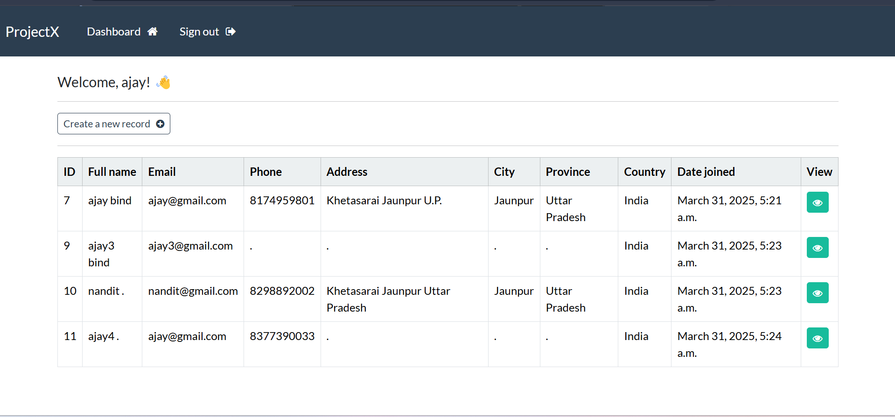
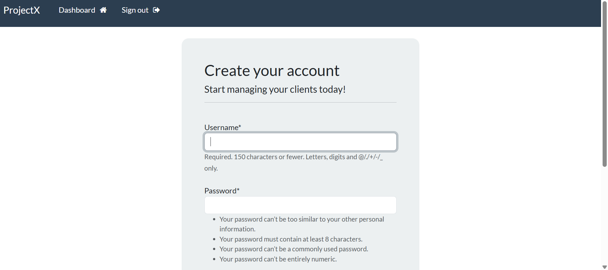
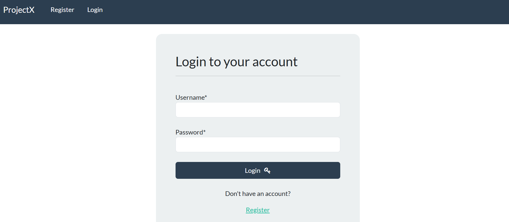

# 📌 Django CRM Application

A **Customer Relationship Management (CRM)** system built with **Django** to manage customer records efficiently. This project includes authentication, CRUD operations, notifications, and a responsive UI using **Bootstrap** and **Crispy Forms**.

## 🚀 Features

✅ **User Authentication** (Login/Logout)  
✅ **Create, Read, Update, Delete (CRUD) Operations** for managing records  
✅ **Notifications** after CRUD operations  
✅ **Responsive UI** with Bootstrap  
✅ **Django Crispy Forms** for enhanced form styling  
✅ **Virtual Environment Setup** for dependency management  
✅ **SQLite Database** as the backend  

---

## 🛠️ Tech Stack

- **Backend:** Python, Django
- **Frontend:** HTML, CSS, JavaScript, Bootstrap
- **Database:** SQLite (`db.sqlite3`)
- **Libraries Used:**
  - `django-crispy-forms` (for beautiful form rendering)
  - `django.contrib.auth` (for authentication management)
  - `django.contrib.messages` (for notifications)

---

---






## 🚀 Installation & Setup

### **1️⃣ Clone the repository**
```sh
git clone https://github.com/your-username/django-crm.git
cd django-crm
```

### **2️⃣ Create and activate a virtual environment**
```sh
python -m venv venv
```
- **Windows:** `venv\Scripts\activate`
- **Mac/Linux:** `source venv/bin/activate`

### **3️⃣ Install dependencies**
```sh
pip install -r requirements.txt
```

### **4️⃣ Apply database migrations**
```sh
python manage.py migrate
```

### **5️⃣ Create a superuser (for Django Admin Panel)**
```sh
python manage.py createsuperuser
```

### **6️⃣ Run the development server**
```sh
python manage.py runserver
```
Access the application at `http://127.0.0.1:8000/`.

---

## 🔑 User Authentication

- **Login:** Users can log in with their credentials.
- **Logout:** Secure logout functionality included.

---

## 📌 CRUD Operations

- **Create:** Add new customer records using forms.
- **Read:** View a list of customers.
- **Update:** Edit existing customer details.
- **Delete:** Remove records with confirmation.
- **Notifications:** Success messages displayed after each action.

---

## 🎨 UI and Styling

- **Bootstrap** for responsive design.
- **Django Crispy Forms** for well-styled forms.
- **Templates:** Extends `base.html` for consistency.

---

## 🔗 API Endpoints

| Method | Endpoint           | Description            |
|--------|------------------|------------------------|
| GET    | `/dashboard`              | Home/Dashboard Page    |
| GET    | `/register/`        | registeration Page            |
| GET    | `/my-login/`        | Login Page            |
| GET    | `/user-logout/`       | Logout User           |
| GET    | `/dashboard/`      | List of Records       |
| POST   | `/create-record/`  | Create New Record     |
| POST   | `/update-record/<id>/` | Update Record |
| POST   | `/delete-record/<id>/` | Delete Record |

---

## 📄 License

This project is licensed under the **MIT License**.

---

## 💡 Contributing

Contributions are welcome! Feel free to open issues or pull requests.

If you found this helpful, give it a ⭐ on GitHub! 🚀

